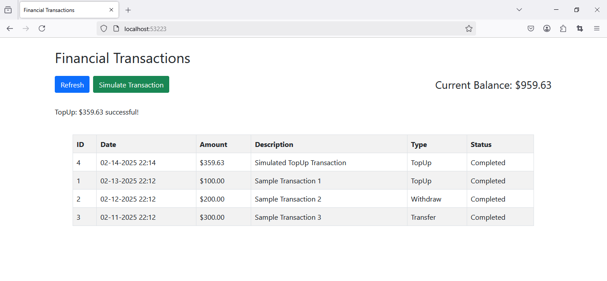
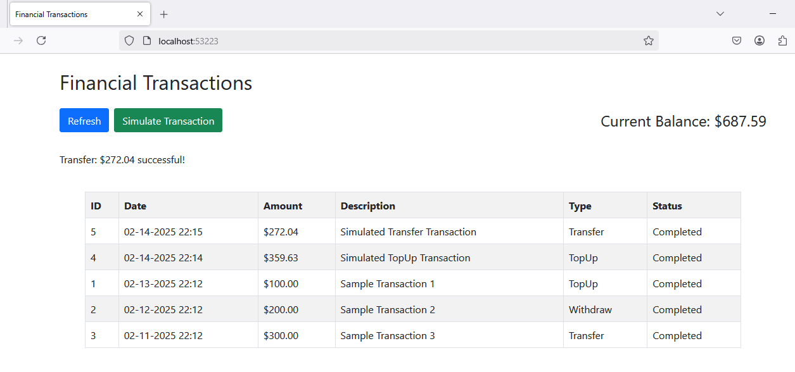

# Tillo Technical Test
## .Net Engineer - VB.Net

> :warning: **PLEASE READ THIS DOCUMENT FULLY**

## Overview
We have provided a basic application that displays and manages simulated transactional data from a local SQLite database. The application is built using ASP.NET Web Forms with VB.NET.

### Current Implementation

The application currently includes:
- A transaction history page
- Integration with a local SQLite database
- A button to refresh the table from an SQLite database
- A button to simulate a transation (deposit, withdrawal, transfer)
- Basic transaction data model
- Simple error handling
- .Net framework version 4.7.2 - `do not change!`

  |   |  
:-------------------------:|:-------------------------:|:-------------------------:
*TopUp Similation*         |   *Transfer Similation*   |  *Withdraw Similation*

## Tasks

Using ASP.NET Web Forms with VB.NET, complete the following tasks.

### 1. Code Refactoring and Architecture Improvements
- Improve the code organization and structure
- Implement testing for only the transaction simulation features

### 2. Transaction Simulation Features
- Implement 3 transaction types:
  - Deposit: Add funds to account balance\
    `Form fields: amount (required), description (opitonal)`
  - Withdrawal: Remove funds from account balance \
    `Form fields: amount (required), description (opitonal)`
  - Transfer: Move funds between accounts (no need to verify amount reached another account)\
    `Form fields: amount (required), receiver (required non-empty open text field), description (opitonal)`
- Each transaction should:
  - Generate a unique transaction ID
  - Record timestamp
  - Include amount, description, type and status
  - Update account balance(s) accordingly
- Validate:
  - Sufficient funds for withdrawals/transfers
  - Valid amount (positive, within limits)
  - Required fields

### 3. Implement RESTful APIs - `Bonus`
*No need for authentication and authorization*
- Create API(s) for the transaction simulation features
- Refactor the transaction simulation features to use these APIs
- Implement proper API versioning
- Add API documentation using Swagger/OpenAPI - `optional`

## Evaluation Criteria
- Use of appropriate architectural and design patterns (e.g. SOLID principles, dependency injection, clean code)
- Security considerations and fintech security best practices

> [!NOTE]
> It shouldn't take you more than 24 hours to complete.

Have fun coding! 🚀

The Tillo Team
